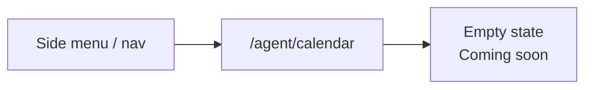
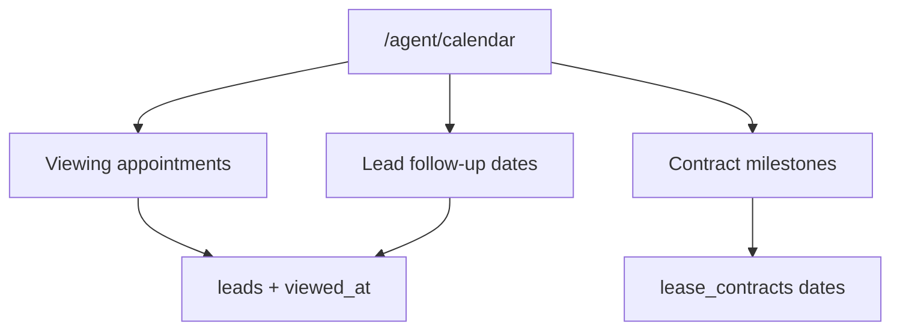

# Agent calendar — Flow (placeholder)

| | |
|--|--|
| กลับ | [README](./README.md) |
| API | [api.md](./api.md) |

---

## 1. สรุป

**Calendar** อยู่ในเมนู agent แล้ว แต่ยังเป็น **placeholder** — แสดง empty state ไม่โหลดข้อมูล

---

## 2. User journey (ปัจจุบัน)

---

## 3. Placeholder UX

| องค์ประกอบ | พฤติกรรม |
|------------|----------|
| Shell | `AgentModePage` · title `agent.pages.calendarTitle` |
| เนื้อหา | ไอคอน calendar + ข้อความ `agent.calendar.emptyTitle` / `emptyMessage` |
| Loading | ไม่มี — ไม่เรียก API |
| Error | ไม่มี |
| CTA | ไม่บังคับ — อาจมีปุ่มกลับ dashboard (optional) |

**ห้าม** mock ข้อมูลนัด · ห้าม calendar grid ปลอม — รอ spec รอบถัดไป

---

## 4. i18n (แนะนำ)

Prefix: `agent.calendar.*` · `agent.pages.calendarTitle`

| Key | ตัวอย่าง (th) |
|-----|----------------|
| `agent.pages.calendarTitle` | ปฏิทิน |
| `agent.pages.calendarDescription` | นัดหมายและติดตามงาน |
| `agent.calendar.emptyTitle` | เร็ว ๆ นี้ |
| `agent.calendar.emptyMessage` | ปฏิทินนัดหมายกำลังพัฒนา |

ครบ `th.ts`, `en.ts`, `zh.ts`, `ja.ts`, `types.ts` เมื่อ implement UI

---

## 5. Navigation

| ช่องทาง | Calendar |
|---------|----------|
| Side menu / More | ✅ |
| Tab bar | ❌ (ยกเว้นจะย้ายในอนาคต) |
| Web sidebar | ✅ |

ลำดับเมนูเต็ม — [README § Navigation](./README.md#navigation-agent)

---

## 6. อนาคต (draft — ไม่ implement)

Spec รายละเอียดจะเพิ่มเมื่อเริ่ม pack จริง (อาจมี `agent_calendar_events` หรือ derive จาก leads)
