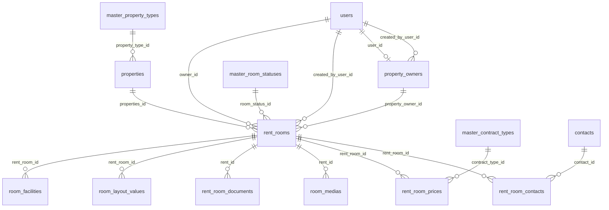

# Agent create room — Database

| | |
|--|--|
| กลับ | [README](./README.md) |
| DDL | [schema.sql](./schema.sql) |

**Prerequisite:** [roles/schema.sql](../../roles/schema.sql)

---

## 1. ERD



---

## 2. Discriminator + visibility (tag)

| Column | Agent scout | Owner listing |
|--------|-------------|---------------|
| `is_scout_room` | `true` | `false` |
| `visibility` | **`private`** = ไม่ public · **`published`** = โชว์ Guest search | `NULL` |
| `owner_id` | `NULL` | FK → users (owner) |
| `property_owner_id` | FK → property_owners | `NULL` |
| `created_by_user_id` | agent | usually `NULL` |

---

## 3. `rent_rooms` — Required vs optional (Agent create)

### Required (minimal create)

| Column | หมายเหตุ |
|--------|----------|
| `properties_id` | FK โครงการ (สร้างใหม่หรือ reuse) |
| `property_owner_id` | FK เจ้าของห้องจริง — กรอกตอนทำสัญญา ไม่ใช้ตอนสร้าง scout |
| `created_by_user_id` | agent |
| `is_scout_room` | `true` |
| `visibility` | `private` (default) หรือ `published` |
| `listing_title` | ชื่อประกาศ |
| `available_from_date` | default `CURRENT_DATE` ได้ |
| `water_rate_per_unit` | validation UI |
| `electric_rate_per_unit` | validation UI |
| `prices` | JSONB array ≥1 แถว |
| `room_status_id` | scout default → `available` |
| `room_medias` | ≥5 รูป category `room` (child table) |

### Optional (มี column ครบ — ไม่บังคับตอนสร้าง)

| Column | หมายเหตุ |
|--------|----------|
| `room_id` | เลขห้องแสดงผล |
| `listing_description` | |
| `latitude`, `longitude` | override ต่อห้อง |
| `custom_facilities` | string[] JSONB |
| `nearby_other`, `nearby_places` | |
| `owner_identity_number` | **ไม่ใช้** scout — Owner verify |
| `owner_bank_name`, `owner_bank_account` | **ไม่ใช้** scout |
| `room_layout_values` | child + master_layouts |
| `room_facilities` | child + master_facilities |
| `rent_room_documents` | optional step |
| `view_count`, `last_viewed_at` | system |

---

## 4. Column catalog (ครบทุก field)

| Column | Type | Null | Scout | Owner |
|--------|------|------|-------|-------|
| `id` | serial | PK | | |
| `room_id` | varchar(100) | yes | opt | opt |
| `listing_title` | varchar(255) | yes | **req** | req |
| `listing_description` | text | yes | opt | opt |
| `available_from_date` | date | no | **req** | req |
| `prices` | jsonb | yes | **req** | req |
| `custom_facilities` | jsonb | no | opt | opt |
| `latitude` | decimal(10,7) | yes | opt | opt |
| `longitude` | decimal(10,7) | yes | opt | opt |
| `nearby_other` | varchar(500) | yes | opt | opt |
| `nearby_places` | jsonb | no | opt | opt |
| `water_rate_per_unit` | decimal(12,2) | yes | **req** | req |
| `electric_rate_per_unit` | decimal(12,2) | yes | **req** | req |
| `owner_identity_number` | varchar(100) | yes | — | opt |
| `owner_bank_name` | varchar(120) | yes | — | opt |
| `owner_bank_account` | varchar(30) | yes | — | opt |
| **`is_scout_room`** | boolean | no | **`true`** | **`false`** |
| **`visibility`** | varchar(20) | yes | **`private`/`published`** | **`NULL`** |
| `created_by_user_id` | int → users | yes | **req** | null |
| `property_owner_id` | int | yes | later contract | null |
| `owner_id` | int → users | yes | **null** | **req** |
| `properties_id` | int | no | **req** | req |
| `room_status_id` | int | no | available | pending_verification… |
| `view_count` | int | no | 0 | 0 |
| `last_viewed_at` | timestamptz | yes | | |
| `created_at`, `updated_at` | timestamptz | no | auto | auto |

---

## 5. Child tables

| ตาราง | FK | บังคับ scout create |
|--------|-----|---------------------|
| `room_medias` | `rent_id` | ✅ ≥5 รูป |
| `room_layout_values` | `rent_room_id` | opt (wizard step 2) |
| `room_facilities` | `rent_room_id` | opt |
| `rent_room_documents` | `rent_id` | opt |

---

## 6. Invariants (CHECK)

```sql
-- Scout
NOT is_scout_room OR (
  created_by_user_id IS NOT NULL
  AND owner_id IS NULL
  AND visibility IN ('private', 'published')
)

-- Owner listing
is_scout_room OR (
  owner_id IS NOT NULL
  AND property_owner_id IS NULL
  AND visibility IS NULL
)
```

---

## 7. ลำดับ write (Agent create)

1. `property_owners` — insert/reuse
2. `properties` — insert/reuse
3. `rent_rooms` — `is_scout_room=true`, `visibility`, …
4. `room_layout_values`, `room_facilities` — optional
5. `room_medias` — required
6. `rent_room_documents` — optional

---

## 8. Query

| ใครดู | เงื่อนไข |
|-------|----------|
| Agent list | `is_scout_room = true AND created_by_user_id = me` |
| Guest public | `is_scout_room = true AND visibility = 'published' AND room_status = available` |
| Owner listings | `is_scout_room = false AND owner_id = me` |
