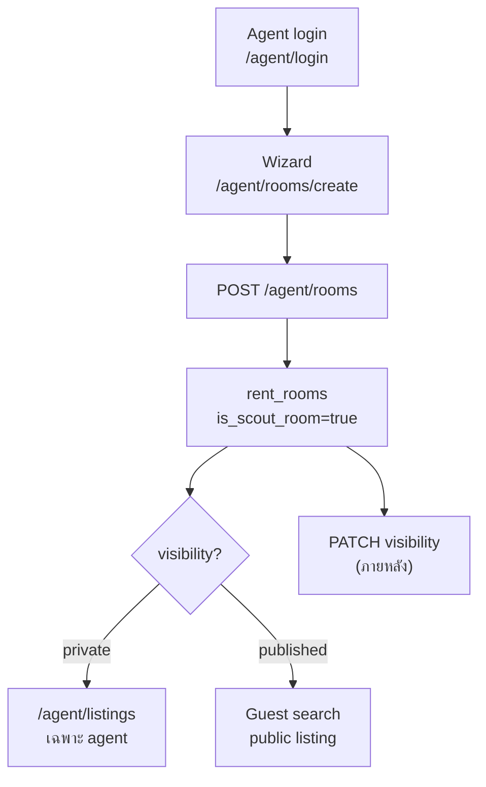
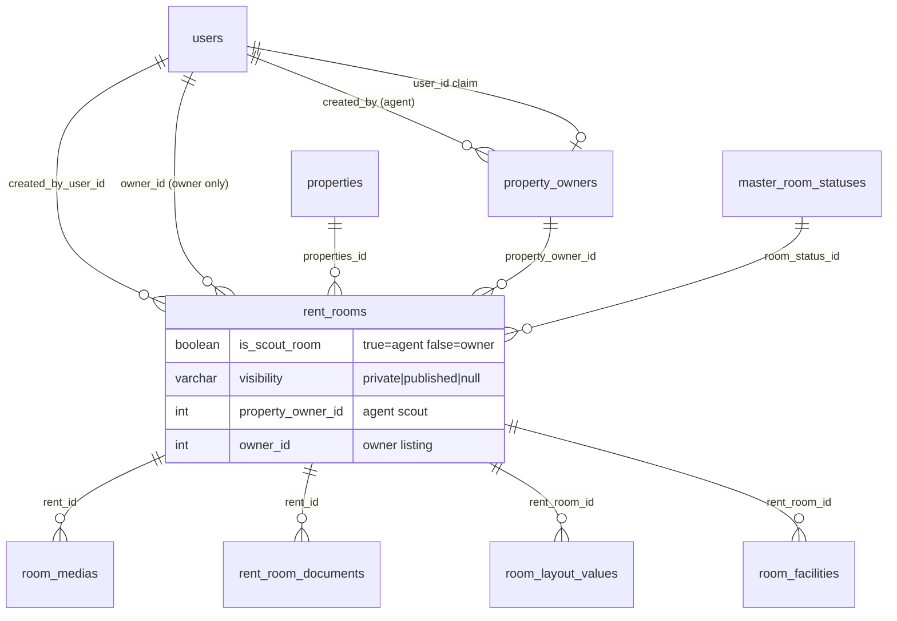
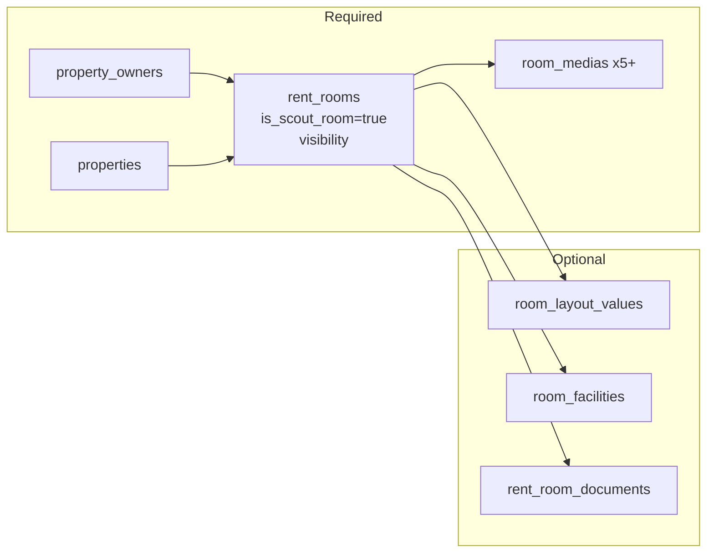
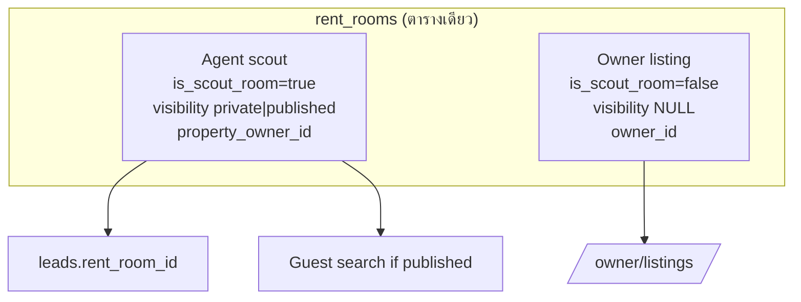

# Agent create room — Flow

| | |
|--|--|
| กลับ | [README](./README.md) |
| Database | [database.md](./database.md) |

---

## 1. สรุป

Agent สร้างห้อง → **`rent_rooms`** แถวเดียวกับ Owner ในอนาคต แต่ตั้ง:

- `is_scout_room = true`
- `visibility = private | published` (tag public/private)

---

## 2. User journey

---

## 2b. ERD (ตารางที่เกี่ยวข้อง)

---

## 2c. DB write order (Agent create)

---

## 3. Wizard — required vs optional

| Step | หัวข้อ | DB |
|-----:|--------|-----|
| 1 | โครงการ / ที่ตั้ง | `properties` ✅ |
| 2 | layout | `room_layout_values` opt |
| 3 | facilities | `room_facilities` opt |
| 4 | nearby | `nearby_*` opt |
| 5 | ค่าเช่า | `prices`, water/electric ✅ |
| 6 | รูป | `room_medias` ✅ (≥5) |
| 7 | Promo AI | ไม่ persist |
| 8 | เอกสาร | `rent_room_documents` opt |
| 9 | เจ้าของห้อง + **visibility** | `property_owners` ✅ · `visibility` ✅ |

Server ตั้งอัตโนมัติ: `is_scout_room=true`, `owner_id=NULL`, `room_status=available`, `created_by_user_id=agent`

---

## 4. Visibility tag

| ค่า | ความหมาย |
|-----|----------|
| `private` | Agent + ผู้สร้างเท่านั้น — ไม่ public |
| `published` | โชว์ Guest search (public listing) |

เปลี่ยนทีหลัง: `PATCH /agent/listings/:id/visibility` — ดู [listings pack](../listings/README.md)

---

## 5. Unified table (อนาคต)

Lead / contract อ้าง **`rent_rooms.id`** ไม่ว่าแหล่ง scout หรือ owner
