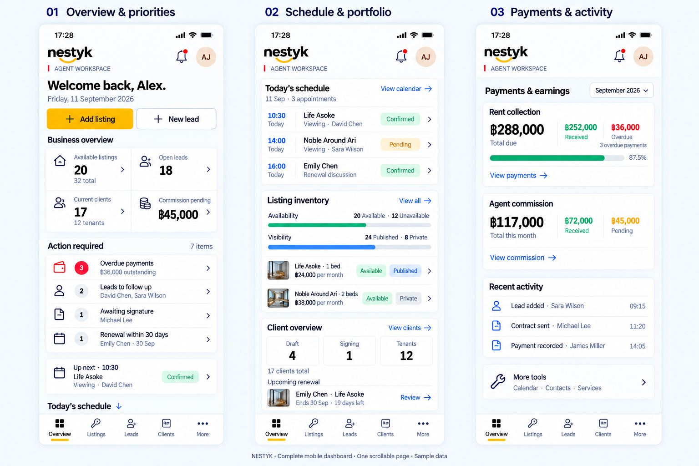
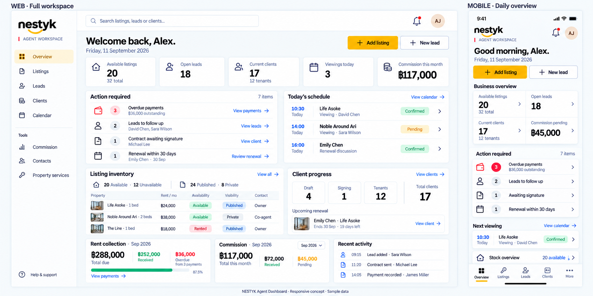

# NESTYK Agent Dashboard — Mobile-first Design & Implementation Brief

อัปเดต: 11 กันยายน 2026  
สถานะ: Design specification / เป้าหมายผลิตภัณฑ์ ยังไม่ใช่หลักฐานว่าฟีเจอร์พัฒนาเสร็จแล้ว

## 1. คำสั่งสำหรับผู้พัฒนาและ AI agent

**ให้เริ่มทำที่ Mobile ก่อนเป็นลำดับแรก และตรวจรับบน iOS Simulator ก่อนเริ่มพัฒนา Web Dashboard**

1. อ่านเอกสารนี้และตรวจ implementation ปัจจุบันก่อนแก้ไข รักษางานที่มีอยู่และการเปลี่ยนแปลงของผู้อื่น
2. เริ่มจาก Mobile shell, Header, navigation และ Dashboard ตามลำดับด้านล่าง
3. ใช้โครงข้อมูลที่ใช้ร่วมกันได้ระหว่าง Mobile และ Web แต่ไม่ต้องสร้าง Web UI ล่วงหน้า
4. ตรวจ Mobile ทั้งการแสดงผล การเลื่อน การกดเข้ารายละเอียด และสถานะข้อมูล ก่อนเข้าสู่เฟส Web
5. Web ใช้ข้อมูลและกฎการนับเดียวกับ Mobile ปรับการจัดวางและจำนวนรายการให้เหมาะกับพื้นที่ ไม่ขยายหน้ามือถือทั้งหน้าให้ใหญ่ขึ้น
6. ห้ามถือว่าตัวเลขในภาพเป็นข้อมูลจริง ห้ามสร้างยอดสุ่มใน production หรือแสดง mock ว่าเป็นข้อมูลสด
7. ฟีเจอร์ที่ยังไม่มี backend ให้ทำผ่าน demo fixture ที่แยกชัดเจนในโหมด preview หรือแสดงสถานะยังไม่พร้อม ห้ามสร้างปุ่มที่กดแล้วไม่ทำอะไร
8. การเปลี่ยนจาก Contracts เป็น Clients เป็นการเปลี่ยนโครงประสบการณ์ผู้ใช้ ไม่ใช่คำสั่งให้ลบข้อมูลสัญญาหรือเปลี่ยน schema โดยไม่ตรวจ dependencies

เอกสารนี้เป็นข้อสรุปล่าสุดด้าน UX/UI ของงานนี้ หากขัดกับภาพหรือ blueprint เดิม ให้ยึดเอกสารนี้ในเรื่องดีไซน์และ navigation ส่วน API/schema ต้องตรวจของจริงก่อนออกแบบ adapter หรือ migration

## 2. เป้าหมายหน้า Overview

เป็นทั้ง Welcome และ Dashboard ของ Agent ผู้ใช้ต้องตอบได้อย่างรวดเร็วว่า:

- กำลังใช้บทบาทอะไร
- ภาพรวมงานและธุรกิจเป็นอย่างไร
- มีอะไรต้องทำก่อน
- นัดหมายถัดไปคืออะไร
- จะไปดูห้อง ลีด ลูกค้า การชำระเงิน หรือค่าคอมได้ตรงไหน

หน้าแรกสรุปทุกหมวดสำคัญ แต่ไม่แสดงรายละเอียดทั้งหมดของทุกเมนู การ์ดและแถวรายการต้องมีปลายทางที่ทำงานต่อได้

## 3. ภาพอ้างอิง

### Mobile ฉบับเต็ม — ทำก่อน

ทั้งสามภาพคือ **ตำแหน่งการเลื่อนของหน้า Overview เดียวกัน** ไม่ใช่สามแท็บ Header และแถบเมนูล่างคงที่ และ Overview ยังคงถูกเลือก

### Web และ Mobile — ทิศทาง responsive

ภาพสร้างด้วย ImageGen แบบ built-in เพื่อใช้เป็น visual reference ไม่ใช่ pixel-perfect specification

แนวทาง prompt: premium international PropTech UI, white/slate surfaces, restrained NESTYK amber, passive Agent workspace label, actionable summaries, separate rent and commission, consistent web/mobile data.

ข้อแก้ไขที่ต้องยึดจากข้อความเหนือภาพ:

- ภาพ Mobile มีนาฬิกา 17:28 แต่แสดง Up next 10:30: ในงานจริงต้องเลือกนัดที่ยังไม่ผ่านไปตามเวลาและ timezone ของผู้ใช้
- ภาษา ไอคอน และตราแบรนด์ในภาพอาจคลาดเคลื่อน ให้ใช้ asset และระบบ i18n จริงของโปรเจกต์
- ความสูงและจำนวนรายการต้อง responsive ไม่บีบตัวอักษรให้เล็กเพื่อเลียนแบบภาพ
- เป้าหมาย Mobile คือภาพรวมและงานสำคัญใน viewport แรก เนื้อหาที่เหลือประมาณอีก 1–2 viewport ตามขนาดจอและขนาดตัวอักษร ไม่ใช่ hard limit ที่ทำให้ข้อความถูกตัด

## 4. สถานะของระบบและช่องว่าง

จุดอ้างอิงที่ตรวจใน repository ระหว่างออกแบบ:

| ส่วน | จุดอ้างอิง | สถานะ/ข้อควรระวัง |
|---|---|---|
| Mobile Dashboard | `apps/consumer-app/app/index.tsx` | ยังมี summary placeholder ต้องตรวจล่าสุดก่อนเริ่ม |
| Mobile navigation | `packages/ui/src/config/mobileTabMatrix.ts` | โครงเดิม Agent มี 6 เมนู เป้าหมายใหม่มี 5 |
| Profile และ role selector | `packages/ui/src/shells/MobileProfileDrawer.tsx` | มี flow สลับบทบาทอยู่แล้ว ให้ใช้ของเดิม |
| Drawer menu | `packages/ui/src/config/mobileDrawerMenuMatrix.ts` | ต้องปรับให้สัมพันธ์กับ Clients/More |
| ห้อง | `apps/consumer-app/lib/agent-listings-api.ts` | มี visibility, roomStatusCode, ราคา, รูป, owner/co-agent |
| ลีด | `apps/consumer-app/lib/agent-leads-api.ts`, `packages/types/src/leads.ts` | มีข้อมูลความต้องการและสถานะ แต่ต้องตรวจ support ของ due date/last contact |
| สัญญา | `docs/new-project/agent/contracts/` | blueprint เดิมยังวางเป็น Contracts module |
| Clients | ข้อสรุปผลิตภัณฑ์ใหม่ในเอกสารนี้ | ต้องออกแบบการเชื่อมลูกค้า–สัญญา–การชำระเงินเพิ่มเติม |
| ปฏิทิน/ค่าคอม/กิจกรรม | ตรวจ implementation และ API ก่อนเชื่อม | การมีเมนูหรือ blueprint ไม่ได้แปลว่ามีระบบพร้อมใช้งาน |
| Web | `apps/agent/app/` | พัฒนาภายหลัง Mobile ผ่านการตรวจรับ |

เอกสาร API เดิมในโฟลเดอร์นี้เป็น blueprint ไม่ใช่ข้อยืนยันว่า endpoint หรือ status ทุกตัวมีอยู่จริง

## 5. Header และบทบาท (แยกตามระดับหน้า)

Header ไม่ใช้แบบเดียวทุกหน้า — สลับเฉพาะ slot ใน `MobileModePage` โดยไม่ remount bottom tab

| ประเภทหน้า | Header | หมายเหตุ |
|---|---|---|
| **Overview** | `☰` · โลโก้ NESTYK + `AGENT WORKSPACE` · `🔔` | ไม่มีคำว่า Dashboard ซ้ำ — มี greeting ใน body |
| **หน้าหลัก** (ห้อง / ลีด / ลูกค้า / More **และเมนูย่อยใน More**) | `☰` · **ชื่อหน้า** + Role เล็กใต้ชื่อ · `🔍` (เมื่อมีค้นหา) | ปฏิทิน / ติดต่อ / สัญญา / บริการ นับเป็นหน้าหลัก — คงเมนู ไม่ใช่ back |
| **รายละเอียด** (modal / stack) | `‹` · ชื่อรายการ · ปุ่มแก้ไข/`⋯` | ไม่โชว์โลโก้หรือ Role ซ้ำ |
| **สร้าง / แก้ไข** (หน้าเสริม) | `‹` · ชื่อหน้า (เช่น ลงประกาศ) | back กลับหน้าต้นทาง เช่น ห้อง; ไม่โชว์ Role / ค้นหา |

กฎร่วม:
- ซ้ายสุด `☰` บน Overview และหน้าหลัก → Profile drawer → เปลี่ยนบทบาทผ่าน role selector เดิมเท่านั้น
- หน้าเสริม เช่น ลงประกาศใหม่ใช้ `‹` back แทนเมนู
- Role / workspace เป็นสถานะ passive ไม่มี dropdown ใน Header
- เปิด Profile drawer จากปุ่มเมนูใน Header (Overview / หน้าหลัก)
- Avatar อยู่ซ้ายของ greeting บน Overview เท่านั้น — แสดงอย่างเดียว ไม่เป็นปุ่ม
- ติด Header เมื่อเลื่อน — พื้นโปร่งเมื่ออยู่บนสุด ทึบขึ้นเมื่อสกอลล์
- Overview + หน้า list ที่ดึงข้อมูล รองรับ pull-to-refresh จาก layout template (ยกเว้น wizard)
- ชื่อและคำทักทายมาจาก profile มี fallback ที่ไม่แสดงชื่อสมมติ

คอมโพเนนต์:
- Overview → `MobileWorkspaceHeader`
- หน้าหลัก → `MobileSectionHeader` (`leading="menu"`)
- หน้าเสริม (ลงประกาศ) → `MobileSectionHeader` (`leading="back"`)
- รายละเอียด → chrome ใน modal

## 6. Navigation เป้าหมาย

### Mobile: 5 เมนู

| เมนู | ขอบเขต |
|---|---|
| Overview / ภาพรวม | Welcome + Dashboard |
| Listings / ห้อง | สต็อกห้องและประกาศ |
| Leads / ลีด | ผู้สนใจและความต้องการก่อนเริ่มสัญญา |
| Clients / ลูกค้า | ลูกค้าตั้งแต่ร่างสัญญาจนถึงผู้เช่า รวมสัญญา การชำระเงิน และต่ออายุ |
| More / เพิ่มเติม | ปฏิทิน ค่าคอม ผู้ติดต่อ บริการ และเครื่องมือรอง |

ปฏิทินเข้าถึงได้จาก Dashboard โดยตรงด้วย ไม่จำเป็นต้องเปิด More ทุกครั้ง

Contracts ไม่เป็นแท็บระดับบนอีกต่อไป แต่เอกสารและประวัติสัญญายังอยู่ภายใต้ลูกค้า ปุ่มแจ้งเตือนสัญญาต้องเปิดลูกค้าและสัญญาที่เกี่ยวข้องโดยตรง

ใช้ icon ที่แยก Leads กับ Clients ได้ชัด ตรวจข้อความไทย/อังกฤษไม่ตัดหรือชนกัน

### Web: หลัง Mobile

Sidebar หลัก: Overview, Listings, Leads, Clients, Calendar  
กลุ่ม Tools: Commission, Contacts, Property services  
เมนู + โลโก้ / Agent workspace อยู่ซ้าย; กระดิ่งอยู่ขวาบน — Profile เปิดจากปุ่มเมนูหรือ avatar ใน greeting ไม่มีเมนู Contracts ซ้ำระดับบน

## 7. Mobile Dashboard — ข้อมูลทั้งหมดและลำดับ

### ช่วงแรก: ภาพรวมและงานสำคัญ

| ส่วน | แสดงอะไร | กดแล้วไปไหน |
|---|---|---|
| Welcome | ชื่อ วันที่ท้องถิ่น ข้อความต้อนรับสั้น | ไม่ต้องเป็นปุ่ม |
| Quick actions | เพิ่มห้อง / สร้างลีด | flow สร้างที่มีอยู่ |
| Business overview | ห้องพร้อมเสนอ, ลีดเปิดอยู่, ลูกค้าปัจจุบัน, ค่าคอมรอรับ | รายการที่กรองตรงตาม metric |
| Action required | ค้างชำระ, ลีดต้องติดตาม, รอลงนาม, ใกล้ต่อสัญญา | รายการงานหรือรายละเอียดต้นทาง |
| Up next | นัดถัดไปที่ยังไม่ผ่าน เวลา โครงการ ผู้ติดต่อ สถานะ | รายละเอียดนัด |

Business overview ใช้ 2×2 grid ตัวเลขอ่านง่าย ป้ายกำกับไม่กำกวม ไม่ต้องมีกราฟหรือเปอร์เซ็นต์เพิ่มทุกช่อง

Action required เรียงงานเกินกำหนดก่อน แล้วตามเวลาที่ต้องทำ ไม่เรียงเพียง updatedAt ล่าสุด ตัวเลขรวมให้นับ work items ด้วย key ที่แน่นอน เช่น payment ID, follow-up ID, signing request ID, renewal contract ID ไม่เรียกผลรวมนี้ว่าจำนวนลูกค้า

### ช่วงกลาง: นัดหมายและพอร์ตงาน

| ส่วน | ข้อมูล | จำกัดรายละเอียดบน Dashboard |
|---|---|---|
| Today’s schedule | เวลา โครงการ/ลูกค้า ประเภทนัด สถานะ | สูงสุด 3 รายการ + View calendar |
| Listing inventory | ห้องพร้อมเสนอ/ไม่พร้อมเสนอ และ Published/Private แยกแกน | summary + ห้องไม่เกิน 2 รายการ |
| Client overview | ร่างสัญญา, รอลงนาม, ผู้เช่า | ตัวเลขสรุป + View clients |
| Upcoming renewal | ลูกค้า โครงการ วันหมดอายุ จำนวนวันที่เหลือ | 1 รายการใกล้สุด + ดูทั้งหมด |

เลือกห้อง preview ด้วยกฎที่แน่นอน เช่น updatedAt ล่าสุด ห้ามแสดงชื่อที่ทำให้เข้าใจว่าเป็นห้องยอดนิยมถ้าไม่มีข้อมูลความนิยม

รายการนัดที่ผ่านมาแล้วต้องมีสถานะตามจริง ไม่ติดป้าย Up next ไม่อนุมาน Completed เพียงเพราะเวลาผ่านไป

### ช่วงท้าย: การเงินและเครื่องมือ

| ส่วน | ข้อมูล | ปลายทาง |
|---|---|---|
| Rent collection | ช่วงเดือน ยอดตามกำหนด รับแล้ว คงค้าง/เกินกำหนด | การชำระเงินใต้ Clients |
| Agent commission | ยอดรวม รับแล้ว รอรับ | รายละเอียดค่าคอม |
| Recent activity | เหตุการณ์ ชื่อลูกค้า/ห้อง เวลา | รายการต้นทาง |
| More tools | ปฏิทิน ผู้ติดต่อ บริการ | More หรือเครื่องมือโดยตรง |

Recent activity ไม่เกิน 3 รายการบน Mobile และไม่จำเป็นต้องแสดงเมื่อยังไม่มี event source

จบ Dashboard หลัง More tools ไม่เพิ่มตารางเต็ม ประวัติสัญญา รายชื่อลูกค้าทั้งหมด หรือรายงานยาวต่อท้าย ใช้ progressive disclosure และลดจำนวน preview บนจอเล็ก

## 8. Clients: ขอบเขตและกฎสำคัญ

- เริ่มเป็น Client เมื่อเริ่ม workflow ร่างสัญญา ไม่ต้องรอเป็นผู้เช่าแล้ว
- รักษาลิงก์กลับ Lead เดิม ไม่ลบประวัติและไม่สร้างบุคคลซ้ำทุกครั้งที่ต่อสัญญา
- Client หนึ่งคนมีหลายสัญญาได้ รวม active, ended และ draft
- ภายใน Client มี Overview, Contracts, Payments และทางเข้าต่อสัญญา
- ต่อสัญญาต้องเก็บฉบับเดิม สร้างฉบับใหม่หรือ version/link ตามโมเดลที่ตกลง ห้าม overwrite ประวัติ
- Client กับ user ที่มี role Tenant ไม่ใช่สิ่งเดียวกัน ลูกค้าอาจยังไม่มีบัญชีเข้าแอป
- จำนวน Client เป็น distinct client IDs ไม่ใช่จำนวนสัญญา
- ถ้าจะแสดงกลุ่มที่รวมกันเท่าจำนวนลูกค้าทั้งหมด ต้องกำหนด primary grouping เช่น มี active tenancy → Tenants; ไม่มี active แต่รอลงนาม → Signing; ที่เหลือมี draft → Draft
- ลูกค้าที่เป็น Tenant และมีสัญญาใหม่รอลงนามยังต้องขึ้นงานรอลงนามได้ แม้ไม่อยู่ primary group Signing
- แยกลูกค้า ended/archived ออกจาก Current clients และยังค้นประวัติได้ กฎนี้ต้องตรงกันทั้ง Web/Mobile/API

## 9. นิยามข้อมูลและการคำนวณ

| ข้อมูล | กฎ |
|---|---|
| Available listings | นับจากสถานะพร้อมเสนอที่ map กับ roomStatusCode จริง ไม่อนุมานจาก Published |
| Visibility | Published/Private เป็นคนละแกนกับ availability; null/unknown ต้องจัดการแยก |
| Open leads | ตกลง status mapping ของระบบจริง ไม่ถือว่าทุก Lead เป็น open; booked/converted/lost ต้องมีขอบเขตชัด |
| Follow-up due | ต้องมี dueAt/last-contact หรือ event ที่เชื่อถือได้ ห้ามใช้ createdAt แทนเวลาติดต่อโดยเงียบ ๆ |
| Overdue payment | มียอดคงค้างและเลย dueAt หลังใช้ timezone/กฎ grace period ที่กำหนด |
| Upcoming renewal | สัญญาที่เกี่ยวข้องหมดอายุในช่วงกำหนด เช่น 30 วัน ไม่ใช่ทุกสัญญาที่มี endDate เก่า |
| Pending commission | เงินค่าคอมที่มีสิทธิ์รับแต่ยังไม่รับ ไม่ถือว่า overdue โดยอัตโนมัติ |
| Next appointment | รายการถัดไปที่ยังเกี่ยวข้อง ไม่ cancelled และเวลาไม่ผ่านตามกฎนัดที่กำลังดำเนินอยู่ |
| Activity | event จริงพร้อม timestamp ไม่สร้างขึ้นจากข้อความใน mockup |

การเงินต้องแยก **ค่าเช่าที่ติดตามให้ลูกค้า/เจ้าของ** กับ **ค่าคอมที่เป็นรายได้ Agent** ไม่รวมเป็นรายได้เดียว

ยอดค่าเช่าคงค้างอาจมีทั้งยังไม่ถึงกำหนดและเกินกำหนด หากมีทั้งสองอย่างให้แสดงแยก ไม่เรียกส่วนต่างทั้งหมดว่า overdue จัดการ partial payments, refunds, cancellations และสกุลเงินตามโมเดลจริง ไม่รวมหลายสกุลเงินโดยไม่มีวิธีแปลงที่ตกลง

แสดงงวดรายงานบนการ์ดการเงิน ส่วนสต็อกและงานเร่งด่วนเป็นสถานะปัจจุบัน ไม่เปลี่ยนไปตามตัวกรองเดือนของ Commission โดยไม่ได้บอกผู้ใช้

## 10. Demo fixture สำหรับตรวจดีไซน์

| Metric | ค่าตัวอย่าง |
|---|---:|
| ห้องทั้งหมด | 32 |
| พร้อมเสนอ / ไม่พร้อมเสนอ | 20 / 12 |
| Published / Private | 24 / 8 |
| Open leads | 18 |
| Current clients | 17 |
| Draft / Signing / Tenants | 4 / 1 / 12 |
| นัดวันนี้ | 3 |
| Overdue payments / follow-ups / signing / renewal work items | 3 / 2 / 1 / 1 |
| Action required รวม | 7 |
| ค่าเช่าตามงวด / รับแล้ว / เกินกำหนด | ฿288,000 / ฿252,000 / ฿36,000 |
| ค่าคอมรวม / รับแล้ว / รอรับ | ฿117,000 / ฿72,000 / ฿45,000 |

ตัวอย่างค่าเช่านี้สมมติว่ายอดคงค้างทุกส่วนเลยกำหนดแล้ว และไม่มี adjustment จึงบวกกันได้ตรงกัน ห้ามใช้สมมติฐานนี้กับข้อมูลจริงทุกกรณี

เวลาเดโมต้องสอดคล้องกัน ใช้ clock ควบคุมได้ใน preview หรือสร้างนัดสัมพันธ์กับเวลาเดโม ไม่ hard-code นัดอดีตเป็น Up next

## 11. Web Dashboard — เฟสถัดไป

ใช้ข้อมูลร่วมกับ Mobile แต่แสดงรายละเอียดเพิ่มตามพื้นที่:

1. Top bar: global search, notifications, profile; greeting และ quick actions
2. KPI 5 ช่อง: Available listings, Open leads, Current clients, Viewings today, Commission this month
3. แถวหลัก: Action required ประมาณ 60% + Today’s schedule 40%
4. แถวถัดมา: Listing inventory table + Client progress และ Upcoming renewal
5. แถวล่าง: Rent collection, Commission, Recent activity

ตารางห้องบน Web แสดงประมาณ 3–5 รายการ: โครงการ ราคา สถานะห้อง visibility และ contact/source; ถ้าแสดง Owner/Co-agent ให้ใช้หัวคอลัมน์ Source ไม่เรียกว่าเป็นชื่อติดต่อ

Sidebar ย่อได้เมื่อพื้นที่จำกัด การ์ดเปลี่ยนเป็น 2 หรือ 1 คอลัมน์ตามพื้นที่จริง ห้ามมี horizontal scroll ทั้งหน้า ตารางอาจเลื่อนในกรอบหรือเปลี่ยนเป็นรายการ

ค้นหารวมต้องรองรับจริงจึงเปิดใช้ ถ้ายังไม่มี global search ให้ใช้การค้นหาในแต่ละโมดูลก่อน ไม่ทำช่องค้นหาที่ดูใช้งานได้แต่ไม่มีผลลัพธ์

## 12. ระบบดีไซน์และ Accessibility

- ใช้โลโก้จริงจาก `packages/ui/assets/logo/` ไม่ใช้โลโก้ที่ AI วาดเป็น production asset
- ใช้ design tokens จาก `packages/ui/src/theme/tokens.ts`
- Brand amber `#F8B615`, Agent role `#FF0052`, background `#F8FAFC`, primary text `#211E1E`
- ใช้สีแดงเฉพาะข้อผิดพลาด/เกินกำหนด สีเขียวจ่ายแล้ว/ยืนยันแล้ว สีเหลืองเพื่อการกระทำหลักและการเตือนที่ไม่ใช่ error
- ใช้ข้อความหรือ icon ร่วมกับสีเสมอ Role ไม่ใช่จุด online status
- ใช้ font ของแอปจริง: Mitr/Noto Sans Thai/Baloo ตามระบบปัจจุบัน ภาพภาษาอังกฤษใช้เป็นแนวทาง hierarchy ไม่ใช่คำสั่งเปลี่ยน font ทั้งแอป
- รองรับไทยและอังกฤษผ่าน i18n; format วัน เวลา เงิน ตาม locale และ currency ของข้อมูล
- Body ประมาณ 14–16 pt, metadata 12–13 pt, heading 20–24 pt; รองรับขยายตัวอักษรและการขึ้นหลายบรรทัด
- พื้นที่สัมผัสอย่างน้อย 44×44 pt บน iOS และประมาณ 48 dp บน Android
- ตรวจ contrast, screen-reader labels, focus order, safe area และ keyboard focus สำหรับ Web
- Header/Bottom navigation ไม่บังรายการท้ายสุด; viewport สั้นยังเลื่อนถึงทุก action ได้
- ไม่ใช้ ellipsis ซ่อนยอดเงิน สถานะสำคัญ หรือชื่อเมนูล่าง

## 13. States และ interaction ที่ต้องออกแบบด้วย

| State | พฤติกรรม |
|---|---|
| Loading | skeleton ตามขนาด section ไม่แสดง 0 ก่อนข้อมูลมา |
| Empty account | ทักทาย + CTA เพิ่มห้อง/ลีดแรก ไม่สร้างกิจกรรมปลอม |
| No urgent work | ข้อความไม่มีงานที่ต้องจัดการและลดความสูง section |
| No appointment | ไม่มีนัดหมาย พร้อมทางเข้าปฏิทิน |
| Missing integration | preview ใช้ fixture มีป้าย demo; production แสดง unavailable หรือซ่อนตาม capability |
| Partial failure | section ที่สำเร็จยังใช้ได้ section ที่ล้มเหลวมี retry |
| Stale data | แสดงเวลาอัปเดตล่าสุดเมื่อมีจริง พร้อม refresh ไม่ใช้ข้อความ Live โดยไม่มีระบบรองรับ |
| Permission | แสดงเฉพาะข้อมูลและ action ที่ผู้ใช้มีสิทธิ์ ไม่มีสิทธิ์ไม่เท่ากับยอด 0 |
| Return from detail | รักษาตำแหน่ง scroll/filter และ refresh ข้อมูลที่เปลี่ยนตามเหมาะสม |
| Role change | ล้าง/แยก cache ตาม account+role และโหลด context ใหม่ ไม่แสดงข้อมูลข้ามผู้ใช้ |

Mobile ใช้ pull-to-refresh; Web มี refresh/retry ที่เหมาะสม ปุ่มการเงินบน Dashboard เปิดรายละเอียดก่อน ไม่บันทึกจ่ายเงินหรือเปลี่ยนสัญญาจากการแตะการ์ดสรุป

## 14. แผนข้อมูลและโครงสร้างพัฒนา

สร้าง shared domain/view-model สำหรับ summary, work items, appointments, inventory, client summary, rent, commission และ activity แยกจาก layout platform

สถานะข้อมูลแต่ละ section ควรแยก available/loading/error/not-configured และมี updatedAt เมื่อมีจริง; การไม่มี backend ต้องไม่ถูกแปลงเป็นค่าศูนย์

เสนอ aggregate dashboard endpoint หรือ service adapter เพื่ออ่านข้อมูลที่นับครบทั้งบัญชี เอกสาร `api.md` เดิมเป็นจุดตั้งต้นที่ต้องขยาย ไม่ถือว่ามี endpoint พร้อมแล้ว

- ห้ามคำนวณยอดรวมทั้งหมดจากหน้าแรกของ paginated lists
- Scope ทุก aggregate ตาม account/agent และสิทธิ์ที่ระบบใช้จริง
- Client กรอง work item ไปปลายทางด้วย ID/filter ที่ backend รองรับ ตรวจ route ก่อนเชื่อม ไม่สร้าง URL ที่ไม่มีหน้า
- Mock และ API adapters ใช้ shape เดียวกัน พร้อม fixture ที่ deterministically ตรวจได้
- ขอบเขตชัดเจนระหว่าง domain data กับ formatted display strings เพื่อรองรับ i18n/Web

## 15. ลำดับส่งมอบ

### Phase 1 — Mobile design preview

- Implement Header, five-tab navigation และ reuse Profile role switch
- ทำ Dashboard ทุก section ด้วย fixture และทุก state สำคัญ
- ปรับ Clients entry/More ตามขอบเขตโดยไม่ทำลาย Contracts flow เดิม
- ตรวจบน iPhone Simulator ทั้งจอเล็ก/ใหญ่ ภาษาไทย/อังกฤษ และการเลื่อนจริง

### Phase 2 — Mobile integration และตรวจรับ

- เชื่อมห้อง/ลีดที่พร้อมก่อน; ตรวจ counts กับข้อมูลจริง
- พัฒนา/เชื่อม Clients, calendar, payments, commission ตาม dependency ที่ตรวจพบ
- ฟีเจอร์ยังไม่พร้อมต้องมี truthful state ไม่ใช่ตัวเลข mock ใน production
- ตรวจทุก deep link, role switch, permissions, refresh, loading/empty/error และการกลับจาก detail
- **ผ่าน Mobile acceptance ก่อนเริ่ม Phase 3**

### Phase 3 — Web

- นำ model และ business rules ที่ตรวจแล้วมาใช้
- ทำ sidebar, search ตาม capability, responsive grid และตาราง
- ตรวจ Web กับข้อมูลบัญชี/ช่วงเวลาเดียวกับ Mobile ต้องให้ยอดตรงกัน

## 16. Acceptance checklist

- [ ] เริ่มและตรวจรับ Mobile ก่อน Web
- [ ] Header แสดง Agent workspace แบบ passive และเปลี่ยน Role ผ่าน Profile เดิมเท่านั้น
- [ ] Mobile มี 5 เมนู Overview / Listings / Leads / Clients / More
- [ ] Contracts และ Payments เข้าผ่าน Client ที่เกี่ยวข้องได้ และเก็บประวัติเดิม
- [ ] Viewport แรกเห็นภาพรวมและงานเร่งด่วน โดยตัวอักษรไม่เล็กเพื่อยัดข้อมูล
- [ ] หน้าเดียวเลื่อนจบได้ Header/Bottom bar ไม่บังเนื้อหา
- [ ] Published แยกจาก Available; Client แยกจากจำนวนสัญญา
- [ ] Pending แยกจาก Overdue; ค่าเช่าแยกจากค่าคอม
- [ ] Action required รวมได้ตามกฎ work item และ deep link ถูกต้อง
- [ ] Up next ไม่ชี้นัดอดีต; วันที่และ timezone ถูกต้อง
- [ ] ค่ารวมมาจาก aggregate ครบชุด ไม่ใช่เฉพาะหน้าแรกของรายการ
- [ ] ภาษาไทย/อังกฤษ, accessibility, font scaling และ empty/error states ผ่านการตรวจ
- [ ] ไม่มีปุ่มตาย ตัวเลขสุ่ม คะแนน matching หรือ growth ที่ไม่มีข้อมูลรองรับ
- [ ] ข้อมูล demo แยกจาก production ชัดเจน
- [ ] Web ใช้กฎเดียวกับ Mobile และเพิ่มรายละเอียดตามพื้นที่ ไม่เปลี่ยนความหมายของ metric

## 17. สิ่งที่ยังไม่รวมในรอบนี้

AI matching score, conversion rate, team leaderboard, partner network, targets และ automation ยังไม่เป็น requirement ของ Dashboard นี้ ต้องมีฟีเจอร์และข้อมูลรองรับก่อนเพิ่ม ไม่เพิ่มเพียงเพราะปรากฏในภาพอ้างอิงของผลิตภัณฑ์อื่น

เอกสารประกอบเดิม: [README](./README.md), [Flow](./flow.md), [API blueprint](./api.md), [Database blueprint](./database.md), [Contracts](../contracts/README.md), [Roles](../../roles/README.md)
