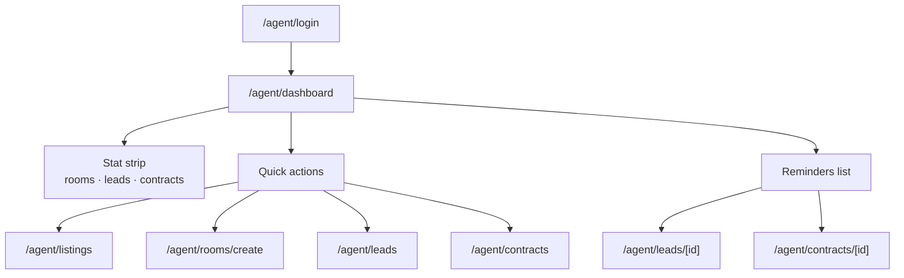

# Agent dashboard — Flow

| | |
|--|--|
| กลับ | [README](./README.md) |
| API | [api.md](./api.md) |
| Database | [database.md](./database.md) |

---

## 1. สรุป

Agent login สำเร็จ → redirect **`/agent/dashboard`** (ดู [roles/flow.md](../../roles/flow.md))

หน้านี้ไม่แก้ข้อมูลโดยตรง — เป็น **hub** อ่านสรุป + ไปยัง pack อื่น

---

## 2. User journey



---

## 3. Layout UX

| ส่วน | Component pattern | หมายเหตุ |
|------|-------------------|----------|
| Shell | `AgentModePage` | โทนเขียว agent · ไม่มี back |
| Welcome | ชื่อจาก `users` / profile | `t('agent.dashboard.welcomeBack')` |
| Stat strip | `DashboardStatStrip` | 3–4 การ์ดตัวเลข |
| Quick actions | `DashboardActionTile` grid | 2×2 หรือ scroll แนวนอน |
| Reminders | `DashboardReminderRow` | 5–10 รายการล่าสุด · ปุ่ม view all |

Pull-to-refresh → reload `GET /agent/dashboard`

---

## 4. Stat cards

| Key | Label (i18n) | ที่มา | ลิงก์เมื่อแตะ |
|-----|--------------|-------|---------------|
| `scoutRooms` | ห้อง scout | `COUNT(rent_rooms)` scout + created_by | `/agent/listings` |
| `publishedRooms` | ประกาศ public | `visibility = published` | `/agent/listings?visibility=published` |
| `newLeads` | Lead ใหม่ | `leads.status = new` | `/agent/leads?status=new` |
| `activeLeads` | กำลังติดตาม | `inprogress` + `viewed` | `/agent/leads?status=inprogress` |
| `pendingContracts` | สัญญารอดำเนินการ | ดู §5 | `/agent/contracts?status=pending` |
| `activeContracts` | สัญญา active | `lease_contracts.status = active` | `/agent/contracts?status=active` |

**MVP:** แสดง 4 การ์ด — `scoutRooms`, `newLeads`, `pendingContracts`, `activeContracts`

---

## 5. Pending contracts (stat)

นับสัญญาที่ยังไม่ `active` / ไม่ terminal:

```
draft
awaiting_signatures
awaiting_agent_review
awaiting_payment
awaiting_payment_verification
```

---

## 6. Quick actions

| Action | Route | Icon |
|--------|-------|------|
| รายการห้อง | `/agent/listings` | list |
| สร้างห้อง | `/agent/rooms/create` | add-circle |
| Leads | `/agent/leads` | people |
| สัญญา | `/agent/contracts` | document-text |

Empty state (agent ใหม่ · ยังไม่มีห้อง): เน้น CTA **สร้างห้องแรก** → `/agent/rooms/create`

---

## 7. Reminders

รวมจาก 2 แหล่ง — เรียง `updated_at DESC` · limit 10

| Kind | เงื่อนไข | ลิงก์ |
|------|----------|-------|
| `lead` | `status IN ('new','inprogress')` · อัปเดตล่าสุด | `/agent/leads/[id]` |
| `contract` | status pending (§5) | `/agent/contracts/[id]` |

Badge tone:

| Tone | ใช้เมื่อ |
|------|----------|
| `warning` | lead `new` · contract `awaiting_agent_review` |
| `default` | lead `inprogress` · contract `draft` |
| `success` | contract พร้อม active (optional ใน reminders) |

ปุ่ม **ดูทั้งหมด** → `/agent/leads` หรือ `/agent/contracts` ตาม kind ที่โฟกัส

---

## 8. Navigation

| ช่องทาง | Dashboard |
|---------|-----------|
| Tab bar (mobile) | ✅ tab หลัก — icon home/leaf |
| Side menu / More | ✅ รายการแรก |
| Web sidebar | ✅ รายการแรก |
| Post-login redirect | ✅ default |

รายการเมนูเต็ม — ดู [README § Navigation](./README.md#navigation-agent)

---

## 9. หน้าจอสรุป

| หน้า | Route |
|------|-------|
| Dashboard | `/agent/dashboard` |
