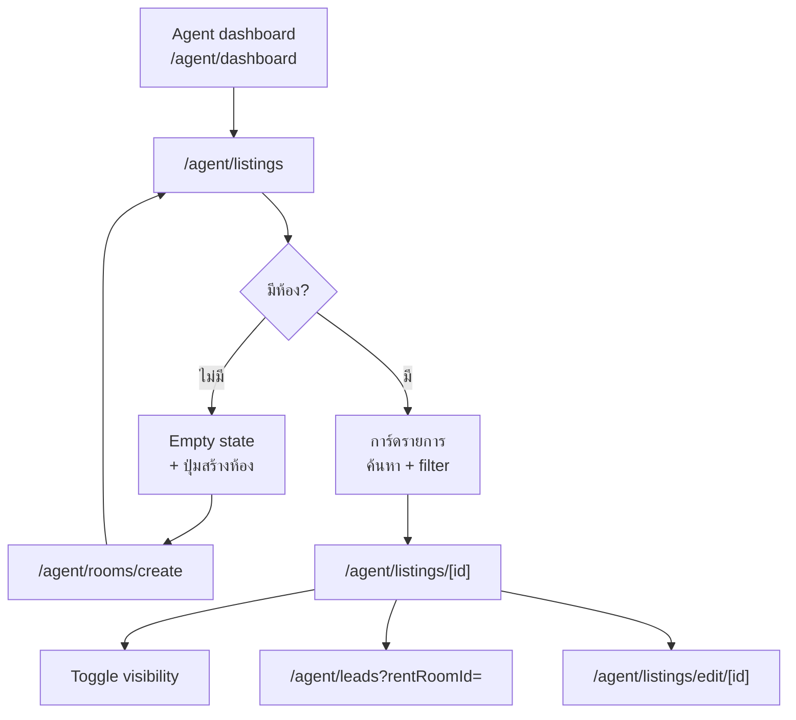
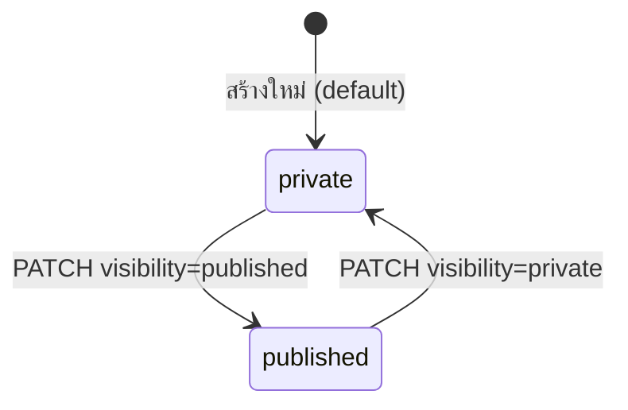

# Agent listings — Flow

| | |
|--|--|
| กลับ | [README](./README.md) |
| API | [api.md](./api.md) |
| Database | [database.md](./database.md) |

---

## 1. สรุป

หลัง [สร้างห้อง](../create-room/flow.md) Agent กลับมาที่ **`/agent/listings`** เพื่อ:

- ดูห้อง scout ทั้งหมดที่ตัวเองสร้าง
- เปิดรายละเอียด · สลับ `visibility` (private ↔ published)
- ไปจัดการ lead ต่อห้อง

---

## 2. User journey

---

## 3. List UX (`/agent/listings`)

| องค์ประกอบ | พฤติกรรม |
|------------|----------|
| Layout | `AgentModePage` · โทนเขียว agent |
| การ์ด | cover · ชื่อประกาศ · โครงการ · ราคา · badge visibility |
| ค้นหา | `q` — ชื่อโครงการ · ชื่อประกาศ · ชื่อ/เบอร์เจ้าของห้อง |
| Filter chip | `visibility`: ทั้งหมด · private · published |
| Sort | default `id DESC` (ใหม่สุดก่อน) |
| FAB / header | ปุ่ม **สร้างห้อง** → `/agent/rooms/create` |
| Empty | ข้อความ + CTA สร้างห้องแรก |

**แสดงเฉพาะ** scout room ของ agent คนนั้น — ไม่เห็นห้อง agent คนอื่น · ไม่เห็นห้อง Owner (`is_scout_room=false`)

---

## 4. Detail UX (`/agent/listings/[id]`)

| ส่วน | เนื้อหา |
|------|---------|
| Hero | รูป cover + gallery |
| ข้อมูลหลัก | title · ราคา · layout · facilities · ค่าน้ำ/ไฟ |
| โครงการ | ที่อยู่ · แผนที่ (ถ้ามี) |
| เจ้าของห้อง | `property_owners` contact |
| Visibility | Switch / segment `private` ↔ `published` |
| Leads | ลิงก์ไป `/agent/leads?rentRoomId={id}` + badge จำนวน lead (optional) |
| Actions | แก้ไข · (อนาคต) ลบ/archived |

Guest จะเห็นห้องนี้ใน search **เฉพาะเมื่อ** `visibility=published` และ `room_status=available`

---

## 5. Visibility toggle

| ค่า | Agent list | Guest search |
|-----|------------|--------------|
| `private` | ✅ เห็น | ❌ ไม่เห็น |
| `published` | ✅ เห็น | ✅ เห็น (ถ้า available) |

---

## 6. แก้ไขประกาศ (`/agent/listings/edit/[id]`)

- ใช้ wizard เดียวกับ [create-room](../create-room/flow.md) แต่โหมด **edit**
- อนุญาตแก้: title · description · ราคา · layout · facilities · medias · property owner · visibility
- **ห้าม** เปลี่ยน `is_scout_room` · `created_by_user_id`
- ถ้ามี lead `booked` หรือสัญญา active → จำกัด field ที่แก้ได้ (ราคา/สถานะ — ตาม business rule ภายหลัง)

---

## 7. Navigation (agent tab / side menu)

ดู [dashboard pack § Navigation](../dashboard/README.md#navigation-agent) — แหล่งความจริงของเมนู agent (รวม Calendar placeholder)

| ลำดับ | Label | Route |
|------:|-------|-------|
| 1 | Dashboard | `/agent/dashboard` |
| 2 | **Listings** | `/agent/listings` |
| 3 | Create room | `/agent/rooms/create` |
| 4 | Leads | `/agent/leads` |
| 5 | Calendar | `/agent/calendar` |
| 6 | Contracts | `/agent/contracts` |

---

## 8. หน้าจอสรุป

| หน้า | Route |
|------|-------|
| รายการห้อง | `/agent/listings` |
| รายละเอียด | `/agent/listings/[id]` |
| แก้ไข | `/agent/listings/edit/[id]` |
| สร้างห้อง | `/agent/rooms/create` |
| Lead ต่อห้อง | `/agent/leads?rentRoomId=` |
