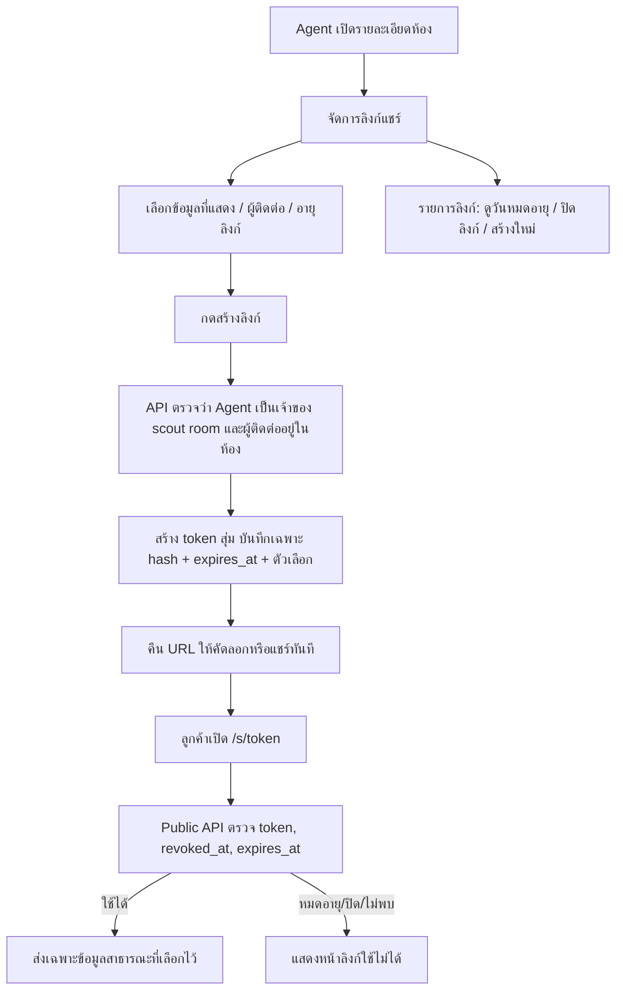

# แชร์รายละเอียดห้องด้วยลิงก์หมดอายุ — flow สำหรับลงมือทำ

สถานะ: **implemented** — ตาราง `room_share_links`, Agent/Public API, หน้า `/s/[token]`, และ `RoomShareLinkSheet` ต่อ API แล้ว (ใช้ `apps/api/src/common/share-link-token.ts` ร่วมกับลิงก์ลงนาม)

## เป้าหมาย

Agent สร้างลิงก์ให้ลูกค้าเปิดรายละเอียดห้องได้โดยไม่ต้องล็อกอิน กำหนดอายุลิงก์ได้ โดยค่าเริ่มต้นคือ **7 วัน** และปิดลิงก์ก่อนครบกำหนดได้ แต่ละลิงก์เลือกส่วนที่ลูกค้าเห็นและผู้ติดต่อได้แยกกัน

การแชร์ด้วยลิงก์เป็นคนละสถานะกับ `rent_rooms.visibility` (`private`/`published`): ห้อง private ก็แชร์ให้คนที่มีลิงก์ได้ โดยไม่กลายเป็นรายการใน marketplace

## Flow

ลิงก์หนึ่งห้องสร้างได้หลายอันเพื่อแยกผู้รับหรือชุดข้อมูล แต่ละอันมีอายุและสถานะของตัวเอง เมื่อหมดอายุหรือถูกปิด API ต้องปฏิเสธทันที ไม่อาศัย timer ในแอปหรือการลบแถวตามเวลา

## Data / API ที่เสนอ

ตาราง `room_share_links`:

| คอลัมน์ | จุดประสงค์ |
|---|---|
| `id`, `rent_room_id`, `created_by_user_id`, `created_at` | อ้างอิงห้องและผู้สร้าง |
| `token_hash CHAR(64) UNIQUE` | SHA-256 ของ token; ไม่เก็บ token ดิบ |
| `expires_at TIMESTAMPTZ`, `revoked_at TIMESTAMPTZ NULL` | บังคับอายุและปิดลิงก์ |
| `share_sections JSONB` | `{photos, price, facilities, location, contact}` เป็น boolean ครบทุก key |
| `contact_id INT NULL` | ผู้ติดต่อที่เลือก ต้องเป็น contact ของห้องนั้น |

ข้อกำหนดฐานข้อมูล: FK ไป `rent_rooms`/`users`/`contacts`, index ที่ `rent_room_id`, unique index ที่ `token_hash`; ใช้เวลา UTC ในฐานข้อมูลและแสดงตาม locale ใน UI

| Endpoint | Auth | หน้าที่ |
|---|---|---|
| `POST /agent/listings/:id/share-links` | Agent | รับ `expiresInDays` (เริ่มต้น 7, เสนอช่วง 1–30), `shareSections`, `contactId`; คืน `url`, `expiresAt`, `id` **ครั้งเดียว** |
| `GET /agent/listings/:id/share-links` | Agent | รายการ metadata และสถานะ; **ไม่คืน token/URL ดิบ** |
| `DELETE /agent/listings/:id/share-links/:linkId` | Agent | ตั้ง `revoked_at`; เรียกซ้ำได้ |
| `GET /public/room-shares/:token` | Public | ตรวจ token และคืน public room DTO เท่านั้น |
| `/s/[token]` ใน `apps/web` | Public | หน้าเว็บมือถือ/เดสก์ท็อปสำหรับลูกค้า; เรียก public API |

การเก็บเฉพาะ hash ทำให้คัดลอก **ลิงก์เดิมหลังออกจากหน้าสร้างไม่ได้**: หน้าสร้างต้องให้คัดลอก/แชร์ทันที ส่วนรายการภายหลังให้ปิดลิงก์หรือสร้างลิงก์ใหม่ หาก product ต้องการคัดลอกลิงก์เดิมภายหลัง ให้ตัดสินใจเรื่องวิธีเก็บ/สร้าง token ที่ปลอดภัยก่อน implement ไม่ควรแอบคืน URL จาก hash ที่ทำไม่ได้

## ขอบเขตข้อมูลสาธารณะ

Public API ต้องสร้าง DTO ใหม่จาก allowlist ตาม `share_sections` ที่บันทึกกับลิงก์ โดยอ่านข้อมูลห้อง **ล่าสุด** เมื่อเปิดลิงก์ ห้ามส่ง `viewMine()` ตรง ๆ เพราะ response ภายในมี `documents`, `contacts.note` และข้อมูลที่ไม่เกี่ยวกับการแชร์

| ตัวเลือก | ข้อมูลที่อนุญาต |
|---|---|
| แสดงเสมอ | ชื่อประกาศสำหรับลูกค้า, คำอธิบาย, ประเภท/ขนาดห้อง, สถานะห้องที่ต้องการสื่อ |
| `photos` | รูปห้องที่อยู่ในรายการ media ของห้อง |
| `price` | ราคาและเงื่อนไขเช่าที่ต้องการเผยแพร่ |
| `facilities` | สิ่งอำนวยความสะดวกและ nearby ที่อนุญาต |
| `location` | ชื่อโครงการ/ย่าน/ที่อยู่หรือพิกัดตามที่ product ตกลง; ถ้าปิดต้องไม่ส่งค่าจาก API |
| `contact` | ชื่อ/เบอร์/ช่องทางติดต่อของ `contact_id` ที่เลือก; ไม่ส่ง note |

ห้ามส่ง `property_owner`, เอกสาร, ข้อมูลธนาคาร/บัตรประชาชน, ชื่อห้องภายใน, แหล่งที่มาของ listing หรือข้อมูล contact อื่น แม้ UI ไม่แสดงก็ตาม ทดสอบ response payload โดยตรง

รูปห้องปัจจุบันใช้ Supabase public URL ดังนั้นการหมดอายุของลิงก์ **ยังไม่ทำให้ URL รูปที่คัดลอกไว้หมดอายุ** หากต้องการปิดการเข้าถึงรูปด้วย ต้องย้ายไป private bucket หรือ proxy ภาพพร้อมตรวจ token เป็นงานแยก

## ส่วนที่ใช้ร่วมกัน (common)

- `apps/api/src/common/share-link-token.ts` มีตัวช่วยสร้าง token สุ่ม 32 bytes, hash, ตรวจรูปแบบ, คำนวณวันหมดอายุ และตรวจหมดอายุแล้ว; ลิงก์ลงนามใช้ตัวช่วยนี้แล้ว ให้ room share ใช้ชุดเดียวกัน
- **อย่า**ใช้ตาราง invite ลงนามร่วมกับ room share: invite ลงนามเป็นลิงก์ใช้ครั้งเดียว อายุ 15 นาที แต่ room share เปิดซ้ำได้ อายุหลายวัน และมี visibility config ต่างกัน
- `packages/feature-listing/src/share-completeness.ts` มี type/default ของ `RoomShareVisibility`; `RoomShareLinkSheet` กับ `MobileRoomDetailBody` อยู่ใน shared feature package อยู่แล้ว ให้ต่อ API และ reuse ตัวเลือกเดียวกัน
- แยก public room DTO/mapper เป็นฟังก์ชันที่ทดสอบได้ เพื่อใช้ทั้ง public API และ preview ให้ตรงกัน; preview ต้องไม่ข้ามกฎการซ่อนข้อมูล

## ลำดับงานที่สั่งต่อได้

1. เพิ่ม migration + TypeORM entity `room_share_links` และลงทะเบียนใน API module
2. ทำ authenticated create/list/revoke พร้อมตรวจ `created_by_user_id`, `is_scout_room`, และ contact membership
3. ทำ public resolver + DTO allowlist + expiry/revoke check ทุก request; ตั้ง `Cache-Control: no-store`, `Referrer-Policy: no-referrer` และ `noindex` สำหรับหน้าแชร์
4. ทำหน้า `/s/[token]` ใน `apps/web`; แสดงสถานะไม่พบ/หมดอายุ/ปิดลิงก์ โดยไม่เปิดเผยข้อมูลห้อง
5. ต่อ `RoomShareLinkSheet` จาก mock URL/local state ไปยัง API; เลือกอายุ 7 วันเป็น default, แสดงวันหมดอายุจริง, คัดลอก/แชร์ URL ที่เพิ่งสร้าง, แสดงรายการและปิดลิงก์
6. ทดสอบการสร้าง/เปิด/หมดอายุ/ปิด, การแยกสิทธิ์ระหว่าง Agent, contact ที่ไม่อยู่ในห้อง, DTO ที่ซ่อน field, และการเปิดห้อง private ผ่านลิงก์โดยไม่เปลี่ยน marketplace visibility

## Acceptance criteria

- Agent เจ้าของห้องสร้างลิงก์ 7 วันได้ และลูกค้าเปิดโดยไม่ล็อกอินได้จนถึงเวลากำหนด
- ลิงก์หมดอายุหรือถูกปิดแล้ว เปิดไม่เห็นข้อมูลห้อง แม้เคยเปิดมาก่อน
- Agent คนอื่นสร้าง ดูรายการ หรือปิดลิงก์ของห้องนี้ไม่ได้
- ปิดตัวเลือกใดแล้ว field นั้นไม่ปรากฏใน public API response
- หน้า preview และหน้า public แสดงชุดข้อมูลเดียวกันตามตัวเลือกที่บันทึก
- ลิงก์แชร์ห้องไม่เปลี่ยนสถานะ `private`/`published` ของห้อง

## Prompt สั้นสำหรับมอบหมายรอบถัดไป

> Implement room share links ตาม `docs/new-project/agent/listings/share-links.md` ให้ครบ migration, NestJS API, public web page, mobile share sheet และ tests ใช้ `apps/api/src/common/share-link-token.ts` กับ visibility type ใน `@nestyk/feature-listing` ตรวจ ownership และ public DTO allowlist ที่ server ทุกครั้ง ค่าเริ่มต้นลิงก์ 7 วัน รองรับ revoke และห้ามใช้ mock URL หลังเชื่อม API
