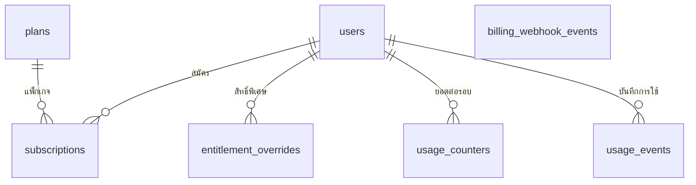

# Billing — Database

DDL: [schema.sql](./schema.sql) · ทุกตารางอ้าง `users(id)` จาก [roles pack](../roles/schema.sql)

---

## 1. ภาพรวม



| ตาราง | หน้าที่ |
|-------|---------|
| `plans` | แพ็กเกจที่ขาย + สิทธิ์ทั้งหมดแบบ `jsonb` |
| `subscriptions` | ผู้ใช้สมัครแพ็กเกจไหน สถานะอะไร ถึงเมื่อไร |
| `entitlement_overrides` | สิทธิ์พิเศษรายคนที่ทับค่าแพ็กเกจ (โปรโมชัน, admin แจก, ชดเชย) |
| `usage_counters` | ยอดใช้รวมต่อผู้ใช้ ต่อฟีเจอร์ ต่อรอบ — ใช้ตัดโควตาแบบเร็ว |
| `usage_events` | บันทึกการใช้แต่ละครั้ง — ตรวจย้อนหลัง กันนับซ้ำ คืนโควตา |
| `billing_webhook_events` | webhook จากผู้ให้บริการรับเงิน — กันประมวลผลซ้ำและเก็บหลักฐาน |

---

## 2. `plans`

| คอลัมน์ | ชนิด | หมายเหตุ |
|---------|------|----------|
| `id` | `SERIAL` PK | |
| `code` | `VARCHAR(50)` UNIQUE | `free` · `pro` · `business` — ชื่อแสดงผลมาจาก i18n `billing.plans.<code>` |
| `is_active` | `BOOLEAN` | `false` = ไม่เปิดขายใหม่ แต่คนที่สมัครอยู่ยังใช้ได้ |
| `is_default` | `BOOLEAN` | แพ็กเกจของคนที่ไม่มี subscription — ต้องมี **แถวเดียว** (`free`) |
| `sort_order` | `SMALLINT` | ลำดับในหน้าเลือกแพ็กเกจ |
| `entitlements` | `JSONB` | `{ "<feature key>": <value> }` ตาม [features.md](./features.md) |
| `store_products` | `JSONB` | รหัสสินค้าของแต่ละช่องทาง `{ "ios": "...", "android": "...", "stripe": "price_..." }` |
| `display_price_thb` | `DECIMAL(10,2)` NULL | ใช้แสดงผลอ้างอิงเท่านั้น ราคาจริงมาจากสโตร์/Stripe |
| `created_at` / `updated_at` | `TIMESTAMPTZ` | |

กติกา:

- แก้ `entitlements` แล้วมีผลทันทีกับทุกคนในแพ็กเกจนั้น (ไม่ต้องปล่อยแอป)
- ห้ามลบแพ็กเกจที่มีคนสมัครอยู่ — ตั้ง `is_active = false` แทน

---

## 3. `subscriptions`

| คอลัมน์ | ชนิด | หมายเหตุ |
|---------|------|----------|
| `id` | `SERIAL` PK | |
| `user_id` | `INT` FK `users` | |
| `plan_id` | `INT` FK `plans` | |
| `status` | `VARCHAR(20)` | `trialing` · `active` · `grace` · `canceled` · `expired` — ดู [flow.md §1](./flow.md#1-สถานะ-subscription) |
| `provider` | `VARCHAR(20)` | `revenuecat` · `stripe` · `manual` (admin ให้เอง) |
| `provider_customer_id` | `VARCHAR(255)` NULL | |
| `provider_subscription_id` | `VARCHAR(255)` NULL | |
| `current_period_start` | `TIMESTAMPTZ` | |
| `current_period_end` | `TIMESTAMPTZ` | |
| `cancel_at_period_end` | `BOOLEAN` | ยกเลิกแล้วแต่ยังใช้ได้จนหมดรอบ |
| `created_at` / `updated_at` | `TIMESTAMPTZ` | |

กติกา:

- ผู้ใช้หนึ่งคนมี subscription ที่ **ให้สิทธิ์อยู่** (`trialing` / `active` / `grace`) ได้ **แถวเดียว** — บังคับด้วย partial unique index
- ไม่มีแถวที่ให้สิทธิ์ = ใช้แพ็กเกจ `is_default`
- แถวเก่าไม่ลบ เก็บเป็นประวัติ

---

## 4. `entitlement_overrides`

| คอลัมน์ | ชนิด | หมายเหตุ |
|---------|------|----------|
| `id` | `SERIAL` PK | |
| `user_id` | `INT` FK `users` | |
| `feature_key` | `VARCHAR(100)` | ต้องอยู่ใน [features.md](./features.md) |
| `value` | `JSONB` | ค่าตามชนิดของฟีเจอร์ |
| `starts_at` / `expires_at` | `TIMESTAMPTZ` | `expires_at` NULL = ไม่หมดอายุ |
| `reason` | `VARCHAR(255)` | เช่น `launch_promo`, `support_compensation` |
| `created_by_user_id` | `INT` FK `users` NULL | admin ที่ให้ |

ลำดับการหาค่าสิทธิ์: **override ที่ยังไม่หมดอายุ → แพ็กเกจของ subscription → แพ็กเกจ default → ค่าเมื่อไม่ระบุใน registry**

---

## 5. `usage_counters`

| คอลัมน์ | ชนิด | หมายเหตุ |
|---------|------|----------|
| `user_id` | `INT` FK `users` | |
| `feature_key` | `VARCHAR(100)` | |
| `period_start` | `TIMESTAMPTZ` | จุดเริ่มรอบโควตา ([flow.md §4](./flow.md#4-รอบโควตา)) |
| `used` | `INT` | ≥ 0 |
| `updated_at` | `TIMESTAMPTZ` | |

PK `(user_id, feature_key, period_start)` — ขึ้นรอบใหม่ = แถวใหม่ ไม่ต้องมี job รีเซ็ต

ตัดโควตาแบบไม่ชนกัน (atomic) ในคำสั่งเดียว:

```sql
INSERT INTO usage_counters (user_id, feature_key, period_start, used)
VALUES ($1, $2, $3, $4)
ON CONFLICT (user_id, feature_key, period_start)
DO UPDATE SET used = usage_counters.used + EXCLUDED.used, updated_at = NOW()
WHERE usage_counters.used + EXCLUDED.used <= $5   -- $5 = limit
RETURNING used;
-- ไม่มีแถวคืน = เกินโควตา → PLAN_LIMIT
```

(ถ้าแถวยังไม่มีและ `$4 > $5` ต้องตรวจก่อน insert ในโค้ด)

---

## 6. `usage_events`

| คอลัมน์ | ชนิด | หมายเหตุ |
|---------|------|----------|
| `id` | `BIGSERIAL` PK | |
| `user_id` | `INT` FK `users` | |
| `feature_key` | `VARCHAR(100)` | |
| `quantity` | `INT` | ปกติ 1 |
| `period_start` | `TIMESTAMPTZ` | รอบที่ถูกนับ |
| `idempotency_key` | `VARCHAR(100)` | จาก header `Idempotency-Key` — UNIQUE ต่อผู้ใช้ |
| `status` | `VARCHAR(20)` | `consumed` · `refunded` |
| `ref_type` / `ref_id` | `VARCHAR(50)` / `VARCHAR(100)` NULL | ผลงานที่เกิด เช่น `lead_match_run` / `123` |
| `created_at` | `TIMESTAMPTZ` | |

- ส่งคำขอซ้ำด้วย `Idempotency-Key` เดิม → คืนผลเดิม ไม่ตัดโควตาซ้ำ
- งานล้มเหลวหลังตัดโควตาแล้ว (เช่น AI ล่ม) → ตั้ง `status = refunded` และลด `usage_counters.used` ใน transaction เดียวกัน

---

## 7. `billing_webhook_events`

| คอลัมน์ | ชนิด | หมายเหตุ |
|---------|------|----------|
| `id` | `BIGSERIAL` PK | |
| `provider` | `VARCHAR(20)` | `revenuecat` · `stripe` |
| `event_id` | `VARCHAR(255)` | รหัส event ของผู้ให้บริการ — UNIQUE ต่อ provider |
| `event_type` | `VARCHAR(100)` | |
| `payload` | `JSONB` | ข้อมูลดิบ |
| `received_at` | `TIMESTAMPTZ` | |
| `processed_at` | `TIMESTAMPTZ` NULL | NULL = ยังไม่ประมวลผล / ล้มเหลว |
| `error` | `TEXT` NULL | |

ได้ event ซ้ำ (`event_id` ซ้ำ) → ตอบ 200 แล้วข้าม
