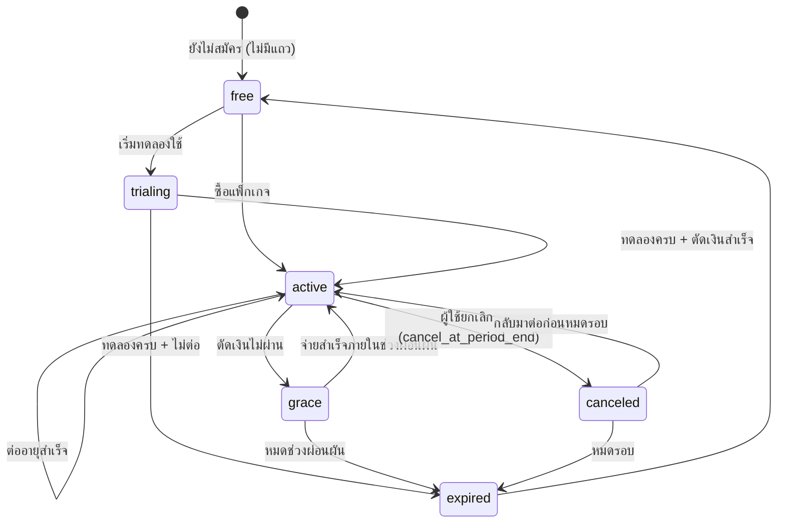
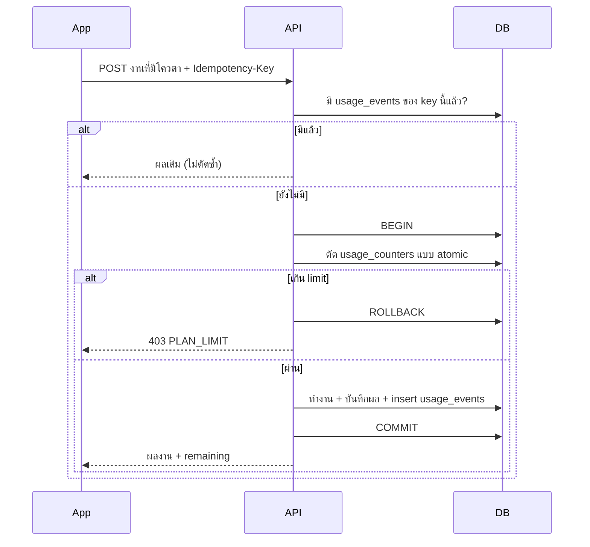

# Billing — Flow

---

## 1. สถานะ subscription

| สถานะ | ได้สิทธิ์ของแพ็กเกจไหม | หมายเหตุ |
|-------|------------------------|----------|
| (ไม่มีแถว) | ใช้แพ็กเกจ default (`free`) | |
| `trialing` | ได้ | |
| `active` | ได้ | |
| `grace` | ได้ | ช่วงผ่อนผันตามที่สโตร์/Stripe กำหนด · แอปแสดงแถบเตือนให้อัปเดตวิธีชำระเงิน |
| `canceled` | ได้จนถึง `current_period_end` | DB เก็บเป็น `active` + `cancel_at_period_end = true` ก็ได้ — เลือกแบบเดียวให้คงที่ |
| `expired` | ไม่ได้ — กลับเป็น default | |

สถานะมาจาก **webhook เท่านั้น** ([api.md §6](./api.md#6-webhook-ไม่ต้องใช้-bearer-token)) แอปไม่เป็นผู้ตั้งสถานะเอง

---

## 2. อัปเกรด / ดาวน์เกรด

| การเปลี่ยน | มีผลเมื่อ | โควตา |
|-----------|-----------|-------|
| อัปเกรด (free → pro, pro → business) | ทันทีที่ได้ webhook | ใช้ limit ใหม่ทันที · ยอดที่ใช้ไปในรอบนี้ยังนับต่อ |
| ดาวน์เกรด (business → pro) | สิ้นรอบปัจจุบัน | รอบใหม่ใช้ limit ใหม่ |
| ยกเลิก | สิ้นรอบปัจจุบัน | หลังหมดรอบใช้ของ `free` |

---

## 3. ข้อมูลเดิมเมื่อสิทธิ์ลดลง

**ไม่ลบข้อมูลผู้ใช้** เมื่อสิทธิ์ลดลง — เก็บค่าเดิมไว้ แต่ server ใช้ค่าที่สิทธิ์อนุญาตตอนทำงาน

ตัวอย่างจับคู่ห้อง: ผู้ใช้ pro ตั้งคะแนนขั้นต่ำ 80% ไว้ แล้วกลับเป็น free

- `leads.match_settings.minScore` ยังเป็น `80`
- ตอนสั่งจับคู่ server ใช้ค่าเริ่มต้น `50` และตอบ `clamped: ["minScore"]`
- แอปแสดงค่าที่ตั้งไว้พร้อมไอคอนกุญแจ "ใช้ได้ในแพ็กเกจ Pro"
- อัปเกรดกลับเมื่อไร ค่าเดิมกลับมาใช้ทันที

---

## 4. รอบโควตา

| ผู้ใช้ | `period_start` |
|--------|----------------|
| มี subscription ที่ให้สิทธิ์ | `current_period_start` ของ subscription |
| ไม่มี (free) | วันที่ 1 ของเดือนปัจจุบัน เวลา 00:00 **Asia/Bangkok** |

- ขึ้นรอบใหม่ = แถว `usage_counters` ใหม่ ไม่ต้องมี cron รีเซ็ต
- `resetsAt` ใน `GET /me/entitlements` = `current_period_end` หรือวันที่ 1 ของเดือนถัดไป

---

## 5. ตัดโควตา (ลำดับในหนึ่งคำขอ)

---

## 6. ระยะการเปิดใช้

| ระยะ | สิ่งที่ทำ | ค่าในแพ็กเกจ `free` |
|------|-----------|---------------------|
| **A. วางระบบ** | ตาราง + `GET /me/entitlements` + ตรวจสิทธิ์ในฟีเจอร์แรก · ยังไม่มีปุ่มซื้อ | กว้างมาก เช่น โควตา 9999 และเปิดทุก boolean — ผู้ใช้ไม่รู้สึกว่าถูกล็อก |
| **B. วัดผล** | ดูยอดใช้จริงใน `usage_counters` เพื่อกำหนดตัวเลขขาย | เหมือน A |
| **C. เปิดขาย** | เปิดหน้าซื้อ ([payments.md](./payments.md)) · แจ้งผู้ใช้ล่วงหน้า | ลดเป็นตัวเลขขายจริงด้วยการแก้แถว `plans` |
| **D. ขยาย** | เพิ่มฟีเจอร์ใหม่เข้าทะเบียน · ทดลองใช้ฟรี · โปรโมชันผ่าน `entitlement_overrides` | |

ระยะ A–B ไม่ต้องรอระบบรับเงิน และไม่มีผลกับผู้ใช้
